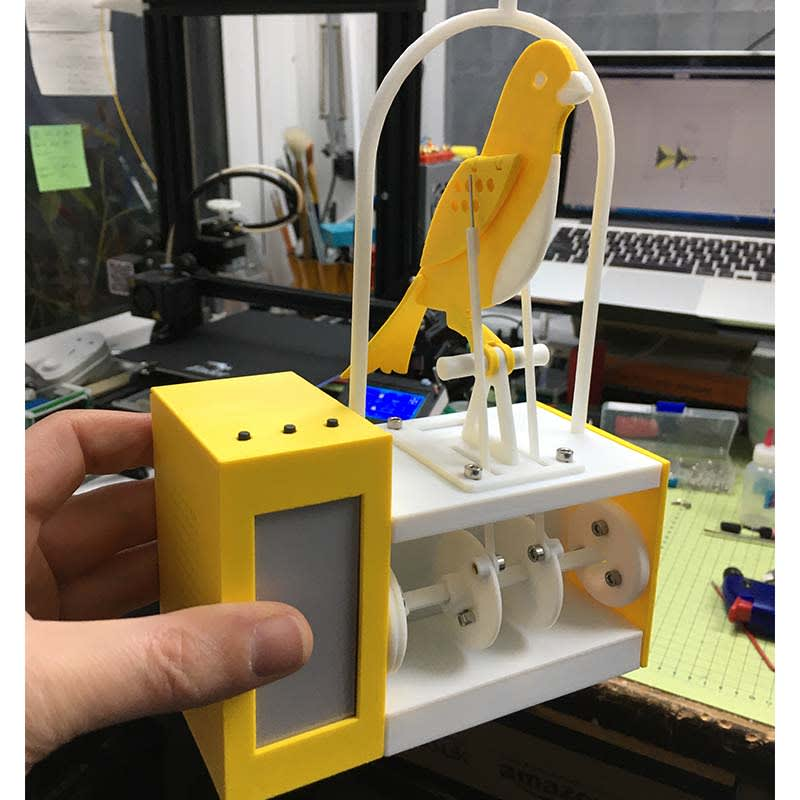

# good-air-canary
An Arduino IoT client for DesignSpark ESDK that reacts to environmental C02 levels

Full details of the build can be found on [DesignSpark](https://www.rs-online.com/designspark/good-air-canary-build-guide).

Prototype circuit in article on [DesignSpark](https://www.rs-online.com/designspark/the-good-air-canary-controller-build-guide).

